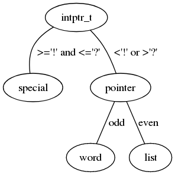

HET
---

HET is a very simple educational programming language dating from 1976
and described in this [document](https://ir.cwi.nl/pub/12870/12870D.pdf),
pages 59-78 and in this [report](https://forth.hcc.nl/w/Verslag/HetLisp).

Overview
--------

HET looks like an imperative version of [Joy](https://github.com/Wodan58/joy1).
The abstract machine that the language implements offers a working stack (WS),
a program stack (PS), and memory (MEM).
The datatypes of the language are: list, word, and 10 specials.

The specials are described in the following table. The arity in this table
tells how many items are taken from the WS and how many are returned.

Special | Arity | Description
------- | ----- | --------------------------------------------------------------
`!` | 1/0 | Take an item from the WS and push this on the PS. Lists are unpacked.
`#` | 0/0 | Commentary until end of line. *Addition*
`*` | 1/1 | Take a word from the WS and push the definition from MEM.
`+` | 2/1 | Take a list and an item from the WS and push the list with the item added.
`.` | 1/0 | Print an item from the WS and remove it. *Addition*
`/` | 1/2 | Take a non-empty list from the WS and push the rest and the first item.
`:` | 2/1 | Take an item and a word from the WS, store this in MEM, and push the item.
`;` | 1/0 | Remove the top item from the WS.
`<` | 1/1 | Take a word from the WS and push a list with the characters of the word.
`=` | 2/1 | Take the top two items from the WS and push t or f depending on equality.
`>` | 1/1 | Take a list of characters from the WS and push the concatenated word.
`?` | 1/1 | Take an item from the WS and push its type: l, w, or s.

Changes
-------

The document has up-arrow and down-arrow as specials. These are non-ASCII
characters, so I have changed them into `*` and `:`. The report has `^` instead
of the up-arrow and `\` instead of `/`.

Additions
---------

The document allows debug output, so I am adding `.`, allowing normal output
and making debug output optional. `#` can be used to outcommenting code.

Installation
------------

There is a [bootable floppy image](https://forth.hcc.nl/w/uploads/Agenda/HET_flop_image) with the version from the report.

Install and start [DOSBox](www.dosbox.com/download.php). At the prompt type:
`boot c:/HET_flop_image` or whatever.
