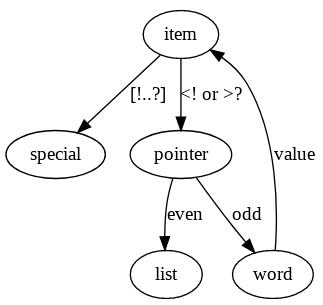

HET
---

Build|Linux|Windows|Coverity
---|---|---|---
status|||

HET is a very simple educational programming language dating from 1976
and described in this [document](https://ir.cwi.nl/pub/12870/12870D.pdf),
pages 59-78 and in this [report](https://forth.hcc.nl/downloadsf/Verslag/HetLisp).

Overview
--------

HET looks like an imperative version of [Joy](https://github.com/Wodan58/joy1).
The abstract machine that the language implements offers a working stack (WS),
a program stack (PS), and memory (MEM).
The datatypes of the language are: word, list, and 16 special characters.
Whitespace characters are needed to separate words from each other.

The specials are described in the following table. The arity in this table
tells how many items are taken from the WS and how many are returned.

Special | Arity | Description
------- | ----- | --------------------------------------------------------------
`!` | 1/0 | Move an item from the WS to the PS, unpacking list items.
`$` | 1/0 | Execute a foreign function. _Addition_
`%` | 2/1 | Create a new local name and assign the next item from the WS. _Addition_
`#` | 0/0 | Ignore the rest of the line. _Addition_
`*` | 1/1 | Replace a word on the WS with its definition.
`+` | 2/1 | Add an item to a list.
`.` | 1/0 | Print an item from the WS and a newline. Remove the item. _Addition_
`/` | 1/2 | Divide a non-empty list into rest and first.
`:` | 2/1 | Take a word and an item from the WS and store the assignment in MEM.
`;` | 1/0 | Remove an item from the WS.
`<` | 1/1 | Take a word from the WS and push a list with the characters of the word.
`=` | 2/1 | Take the top two items from the WS and push `t` or `f` depending on equality.
`>` | 1/1 | Take a list of characters from the WS and push the concatenated word.
`?` | 1/1 | Take an item from the WS and push its type: `w`, `l`, or `s`.

Changes
-------

The document has up-arrow and down-arrow as specials. These are non-ASCII
characters, so I have changed them into `*` and `:`. The report has `^` instead
of the up-arrow and `\` instead of `/`.

Additions
---------

The document allows debug output, so I am adding `.`, allowing normal output
and making debug output optional; `#` can be used to comment out the rest of
the line; `$` adds foreign functions; `%` adds local definitions.

Installation
------------

There is a [bootable floppy-image](https://forth.hcc.nl/downloadsf/HET_flop_image) with the version from the report.

Install and start [DOSBox](https://www.dosbox.com). At the prompt type:
`boot c:/HET_flop_image` or whatever.

Note: The links to the report and the floppy-image are currently dead.
They are mentioned [here](https://forth.hcc.nl/wie-zijn-wij/2010-2014.html).

The version presented here can be built with these commands:

    cmake .
    cmake --build .
