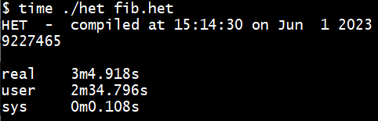
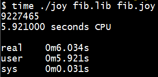
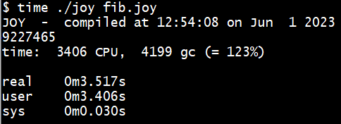
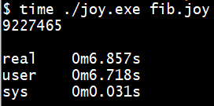
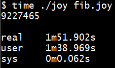
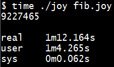

 
==============

Fibonacci
=========

The recursive Fibonacci is a benchmark that can be used to compare different
implementations of the same language. The most recent effort in implementing
Joy is called HET and that gives the starting point of the comparison.

HET
---

The Fibonacci benchmark measures function call overhead. HET has some overhead,
because every time a function is executed, the body of the function gets copied
to the program stack. When functions written in C are called, these functions
need to be searched in the symbol table. When integers are used, they need to
be converted from presentation format to binary format. And all of that needs
to be stored in memory that is allocated from the heap. The result of
calculating fib(35) is given in this picture:

 

42minjoy
--------

The next candidate for comparison is 42minjoy, because this minimal
implementation is quite similar to HET. The body of a function is not copied
to a program stack; instead the function `joy` calls itself when evaluating
the body of a function. Functions are only searched in the symbol table once,
when reading the text of the function; function addresses are used when
evaluating a function. Integers are available in binary format. And the
garbage collector is used, whenever the memory array has been fully used.

 

joy0
----

The super original Joy uses a copying collector that is faster than the
mark/scan collector used in 42minjoy.

 

JOY
---

The original Joy is similar to joy0, but uses a flexible array as memory area.

 

joy1
----

The modified version of Joy is no longer linked to the BDW garbage collector.
It uses a simpler mark/scan collector. That makes it slower than Joy.

 

Moy
---

Moy is similar to joy1. Maybe programmed more efficiently?

 

Coy
---

Coy uses an array as stack. As such it benefits from a modified condition:
`dup small` instead of `small`. The latter also works, but is slower.

 

Source code
===========

HET
---

	#define sub		sub $
	#define add		add $
	#define less		less $
	#define abort		abort $

	(a % ; b % ; a * b *) swap : ;
	#define swap		swap * !

	(a % a *) dup : ;
	#define dup		dup * !

	( () t : ;
	  (1 sub dup fib_rec * ! swap 1 sub fib_rec * ! add) f : ;
	dup 2 less * !) fib_rec : ;
	#define fib_rec		fib_rec * !

	35 fib_rec .
	abort .

The `abort` prevents the cleanup of memory that would require an inordinate
amount of time. Also note that this source must be run through the C
preprocessor before it can be executed.

42minjoy
--------

	fib == dup 2 < [[1 - dup fib swap 1 - fib +] []] index i.

	[35 fib put 10 putch].

The source code comes in two files.

joy0 and JOY
------------

	0 __settracegc.
	35 [small] [] [pred dup pred] [+] binrec.

The `__settracegc` is needed in order to prevent many messages about the
garbage collector that would slow the program down.

joy1 and Moy
------------

	35 [small] [] [pred dup pred] [+] binrec.

joy1 and Moy do not need __settracegc.

Coy
---

	35 [dup small] [] [pred dup pred] [+] binrec.

Coy benefits from using `dup` in the condition.
