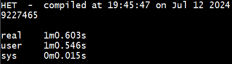
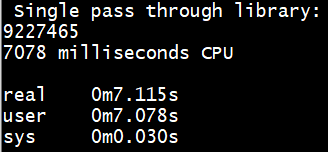
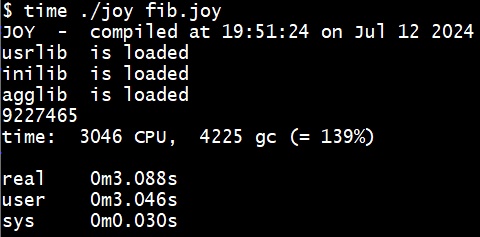
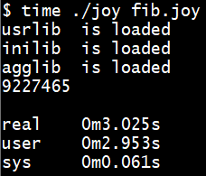
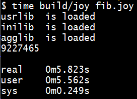
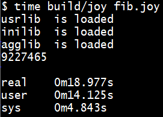
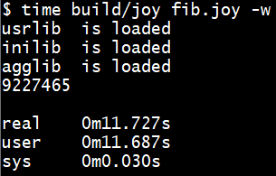
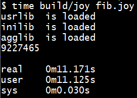
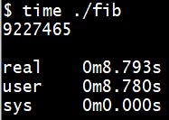
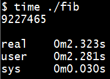

 
==============

Fibonacci
=========

The recursive Fibonacci is a benchmark that can be used to compare different
implementations of the same language. The most recent effort in implementing
Joy is called HET and that gives the starting point of the comparison.

HET
---

The Fibonacci benchmark measures function call overhead. HET has some overhead,
because every time a function is executed, the body of the function gets copied
to the program stack. When functions written in C are called, these functions
need to be searched in the symbol table. When integers are used, they need to
be converted from presentation format to binary format. And all of that needs
to be stored in memory that is allocated from the heap. The result of
calculating fib(35) is given in this picture:

 

42minjoy
--------

The next candidate for comparison is 42minjoy, because this minimal
implementation is quite similar to HET. The body of a function is not copied
to a program stack; instead the function `joy` calls itself when evaluating
the body of a function. Functions are only searched in the symbol table once,
when reading the text of the function; function addresses are used when
evaluating a function. Integers are available in binary format. And the
garbage collector is used, whenever the memory array has been fully used.

 

joy0
----

The super original Joy uses a copying collector that is faster than the
mark/scan collector used in 42minjoy.

 

Legacy
------

The legacy version is similar to joy0, except that it has more builtins.

 

JOY
---

The original Joy is similar to Legacy, but uses a flexible array as memory area.

 

joy1
----

The original Joy linked to the BDW garbage collector.

 

Foy
---

Foy is a Forth-inspired Joy that uses vectors for stack and code.

 

Moy
---

Moy also uses vectors for stack and code. The implementation of those vectors
differ from those of Foy.

 

Soy
---

Soy uses the same code as Moy, compiled to a stand-alone binary.

 

Roy
---

Roy uses code that differs from Moy. It allows recursion on the hardware stack.

 

Source code
===========

HET
---

	#define sub     sub $
	#define add     add $
	#define less    less $

	(a % ; b % ; a * b *) swap : ;
	#define swap    swap * !

	(a % a *) dup : ;
	#define dup     dup * !

	( () t : ;
	  (1 sub dup fib_rec * ! swap 1 sub fib_rec * ! add) f : ;
	dup 2 less * !) fib_rec : ;
	#define fib_rec fib_rec * !

	35 fib_rec .

Note that this source must be run through the C preprocessor before it can be
executed.

42minjoy
--------

	fib == dup 2 < [[1 - dup fib swap 1 - fib +] []] index i.

	35 fib.

The source code comes in two files. The first file is included from
42minjoy.lib

joy0
----

	0 __settracegc.
	35 [small] [] [pred dup pred] [+] binrec.

The `__settracegc` is needed in order to prevent many messages about the
garbage collector that would slow the program down.
s
Legacy, Joy, and joy1
---------------------

	35 [small] [] [pred dup pred] [+] binrec.

Legacy, Joy, and joy1 do not need `__settracegc`.

Foy, Moy, Soy, and Roy
----------------------

	35 [dup small] [] [pred dup pred] [+] binrec.

Foy and Moy benefit from using `dup` in the condition; Soy and Roy require it.

Conclusion
==========

HET is slowest, by far, followed by joy1. Roy is fastest, followed by joy0.
Even though Roy is compiled, it is not significantly faster than joy0. The
reason is that although Roy is compiled, it still uses exeterm, that is the
interpeter, to evaluate programs.
