 
==============

Fibonacci
=========

The recursive Fibonacci is a benchmark that can be used to compare different
implementations of the same language. The most recent effort in implementing
Joy is called HET and that gives the starting point of the comparison.

HET
---

The Fibonacci benchmark measures function call overhead. HET has some overhead,
because every time a function is executed, the body of the function gets copied
to the program stack. When functions written in C are called, these functions
need to be searched in the symbol table. When integers are used, they need to
be converted from presentation format to binary format. And all of that needs
to be stored in memory that is allocated from the heap. The result of
calculating fib(35) is given in this picture:

 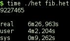

Calculating fib(36) is not possible, because the program runs out of swap
space. Of course, these programs are run without using the garbage collector.

 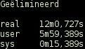

The [BDW garbage collector](https://github.com/ivmai/bdwgc) makes the program
run faster. HET is a small programming language. Adding BDW makes it larger.
In this case it seems worth the trouble.

 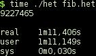

42minjoy
--------

The next candidate for comparison is 42minjoy, because this minimal
implementation is quite similar to HET. The body of a function is not copied
to a program stack; instead the function `joy` calls itself when evaluating
the body of a function. Functions are only searched in the symbol table once,
when reading the text of the function; function addresses are used when
evaluating a function. Integers are available in binary format. And the
garbage collector is used, whenever the memory array has been fully used.

 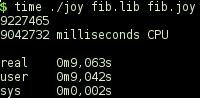

JOY
---

The original Joy uses a copying collector that is faster than the mark/scan
collector used in 42minjoy. The rest is much the same as in 42minjoy.

 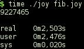

joy1
----

The modified version of Joy was compiled with the BDW garbage collector that
uses a mark/scan. That makes it slower than Joy with its own builtin collector.

 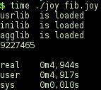

Coy
---

Coy is similar to 42minjoy. It uses the BDW garbage collector; the
collector is not triggered, because all calculations are done on the stack and
the stack is implemented as an array. Coy can also compile joy source code.
Timings of the compiled output are not shown: the whole program is evaluated at
compile time.

 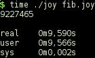

Moy
---

Moy is similar to Joy. Except that it uses an array as stack.

 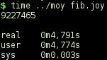

Moy can also be compiled. In fact, there are 3 different ways to compile Moy,
each with a different implementation of the stack.

 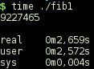
 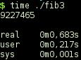
 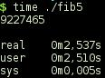

In the case of the Fibonacci benchmark, the first and the last are the same.
They differ in the way that lists are built: at runtime or at compile time.
The middle one also builds lists at runtime, but uses a typeless stack and
that makes it faster than the other two with the distinct disadvantage that
not all Joy programs can be executed as is.

Voy
---

Voy is the successor to Coy and the middle version of Moy. Like HET, symbols
are kept as such and not translated to function pointers after reading. That
makes it slower as an interpreter, because every time a function needs to be
executed, the symbol must be looked up in the symbol table. The main purpose
of Voy is to compile Joy source code.

 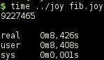

When compiling, Voy executes whatever it can at compile time. This means that
a different program is needed: the Fibonacci number to be calculated must first
be read from the command line.

 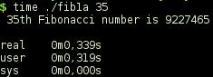

As can be seen from the timings, this last version is fastest. And that is
where HET should be heading. It needs to be compiled in order to be fast.

Source code
===========

HET
---

	#define sub		sub $
	#define add		add $
	#define less		less $
	#define abort		abort $

	(a % ; b % ; a * b *) swap : ;
	#define swap		swap * !

	(a % a *) dup : ;
	#define dup		dup * !

	( () t : ;
	  (1 sub dup fib_rec * ! swap 1 sub fib_rec * ! add) f : ;
	dup 2 less * !) fib_rec : ;
	#define fib_rec		fib_rec * !

	35 fib_rec .
	abort .

The `abort` prevents the cleanup of memory that would require an inordinate
amount of time. Also note that this source must be run through the C
preprocessor before it can be executed.

42minjoy
--------

	fib == dup 2 < [[1 - dup fib swap 1 - fib +] []] index i.

	[35 fib put 10 putch].

The source code comes in two files.

JOY
---

	0 __settracegc.
	35 [small] [] [pred dup pred] [+] binrec.

The `__settracegc` is needed in order to prevent many messages about the
garbage collector that would slow the program down.

joy1
----

	35 [small] [] [pred dup pred] [+] binrec.

joy1 is compiled with BDW activated and thus can handle smaller source code.

Coy
---

	DEFINE	fib == dup 2 < [[1 - dup fib swap 1 - fib +] []] index i;
		nl == 10 putch.

	35 fib put_int nl.

Coy uses `put_int`, because otherwise it cannot distinguish a large integer
from a pointer.

Moy
---

	35 [dup small] [] [pred dup pred] [+] binrec.

Moy must use `dup` in the condition, because the condition is destructive.

Voy
---

	(* This program calculates the nth fibonacci number
	 * using algorithm 1A: naive binary recursion
	 *
	 * compiled: fib1a 35
	 * executed: joy fib1a.joy 35
	 *)
	DEFINE	nl == '\n putch.
	(* fib : n -> n returns N'th Fibonacci number: F(n) = F(n-1) + F(n-2) *)
	DEFINE	fib == [dup small_int] [] [pred dup pred] [+] binrec .
	(* fprint : n -> - calculates and prints F(n) *)
	DEFINE	fprint == dup 'd 3 0 format "th Fibonacci number is " concat_str
		putchars fib put_int nl .
	(* main : - -> - checks the command line arguments and calls fprint *)
	DEFINE	main == [argc 2 =]
			[argv second 10 strtol fprint]
			["Usage: joy fib1a.joy\n" putchars] ifte.
	main .

Voy needs a larger program, because otherwise everything would be executed at
compile time. The code was taken from [Cubbi](http://www.cubbi.com/fibonacci/joy.html).
